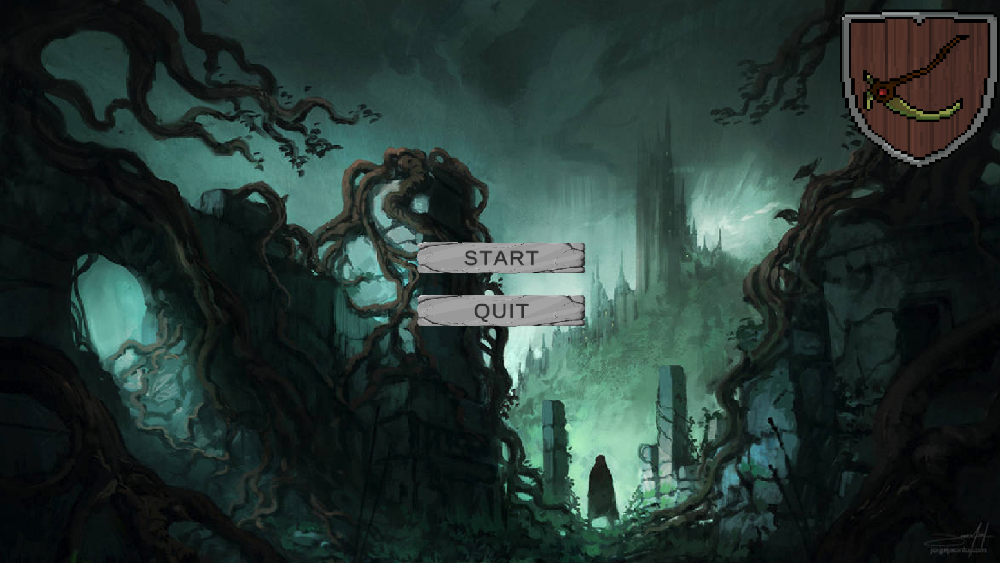
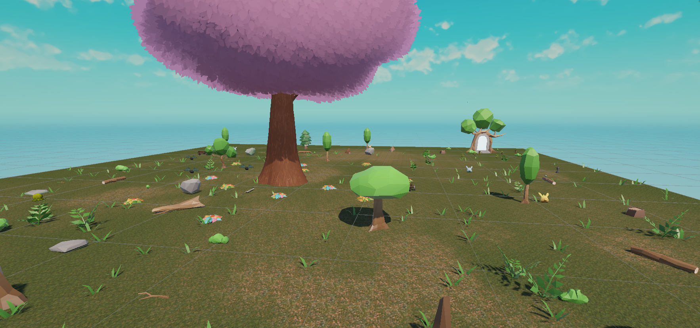
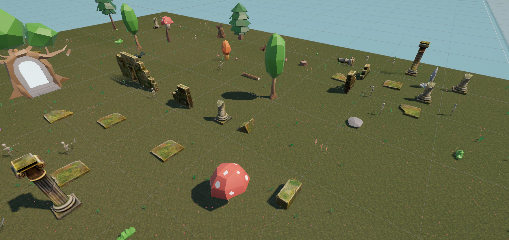
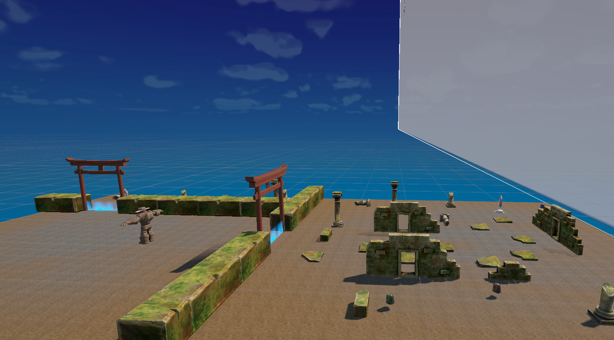

# Vagabond-Reloaded
School Project

## Welcome to "Vagabond-Reloaded"!  
Vagabond-Reloaded is a single player adventure RPG developed as part of aschool project using Unity.

The game features a wide variety of enemies, three large maps to explore, and a decicated "TestDummy" scene that contains all available enemies types, weapon variations, and an additional infinite health test dummy for combat testing.

## Gameplay Overview
The player must locate a hidden portal on each map to progress to the next level.

While searching, players may:

- Encounter hostile enemies
- Discover new weapon variations
- Explore and immerse themselves in the worlds environment

As the game progresses, each level becomes increasingly more lifeless and destroyed in appearance, reflecting the world's gradual decay.

Each level indroduces more powerful enemies, including variants of previously encountered foes.
The journey cluminates in a challenging bos fight at the end of Level Three. After completing the game, the player gains full access to the "TestDummy" scene.

### Weapon Variations
- Fist
- Sword
- Bow

### Enemies

#### Slimes
- Basic Slime
- Fire Slime
- Ice Slime
- Electo Slime

#### Goblins
- Basic Goblin
- Archer Goblin
- Warrior Goblin

#### Rabbits
- Cyan Rabbit
- Green Rabbit
- Red Rabbit
- Yellow Rabbit

#### Bats
- Basic Bat
- Fire Bat
- Ice Bat
- Electro Bat

#### Skeletons
- Basic Skeleton
- Sword Skeleton

#### Ghosts
- Basic Ghost
- Fire Ghost
- Ice Ghost
- Poison Ghost

#### Bosses
- Golem

## Technical Details 

### Engine 
- Unity 3D (Universal Render Pipeline

### Development Tools 
- Unity Asset Store
- GitHub / Sourcetree
- Visual Studio
- Blender
- Adobe Substance Painter
- Mixamo
- Aseprite

## Controls 

### Keyboard & Mpuse
#### Movement
- W / A / S / D - Movement (based on character rotation)
- Mouse - Rotate character
- Space - Jump
- Shift - Dodge
    - Dodge backward if no movement key is pressed
    - Dodge in the pressed movement direction (W / A / S / D + Shift) 
- F - Interact (based on cursor position)

#### Comabt 
- Left Mouse Button (Click / Hold) - Normal / Charged attack
- p - Heal one heart / Revive (Developer cheat)

#### Camera
- Right Mouse Button (Hold) - Rotate camera
- Mouse Wheel (Click) - Reset camera
- Mouse Wheel (Scroll) - Room in / out
- Q / R - Rotate camera left / right

#### UI 
- ESC - Pause menu

#### Others
- 5 / 6 / 7 / 8 - Emotes
 
## Ingame Screenshots

### Tilescreen

### Level One

### Level Two

### Level Three

### Test Dummy Level

## Team:
Heider Jumah 
Lucas Pietruschka

## Special Thanks
Lars REDACTED (3D artist)

**PROJECT CREATED: January 26, 2026** 
**PROJECT END: ----**

#### Known Issues (Bugs) 
- The audio slider streches vusually during runtime
- Boss music doesnt replay after reviving if the player dies during the boss monster (revive only possible via developer cheats)
- Player knockback can push smaller enemies through walls. (Enemy knockback affecting the player works correctly. Just haven't fixed it for enemies yet since it's relatively rare for that to happen)
- if the game is started from any scene other than the Main Menu, the Main Menu music may continue playing until the pause menu is opened or the level is changed via a portal.
- Returning to a previous level may also cause incorrect background music to play.

### Important Notes
- Starting the game from the Main Menu is recommended for the intended gameplay experience. All scenes function independently, but may not initialize audio correctly.
- Inventory and save point systems are not implemented yet.
- The player can still pick up the sword in Level One (near the large tree) and any weapon available in the TestDummy scene.
- Enemy drops (including the Bow dropped by the Golem) are currently not interactable. The Bow functions correctly in the TestDummy scene and can be picked up.
- To pick up weapon, hover over it with the mouse cursor and press F.
    - NOTE: The weapon remains visually on the ground; only the player model updates.
- The player can toggle camera rotation lock in the settings menu.
- Playing in fullscreen mode is recommended when adjusting settings, as UI buttons and slider are currently small and can be missed.
- The boss can only be defeated once per session. To fight the boss again:
    - Restart the game and load the TestDummy scene (fastest access, boss trigger only on the intended entrance point), or
    - Return to the title screen to reset the game state
